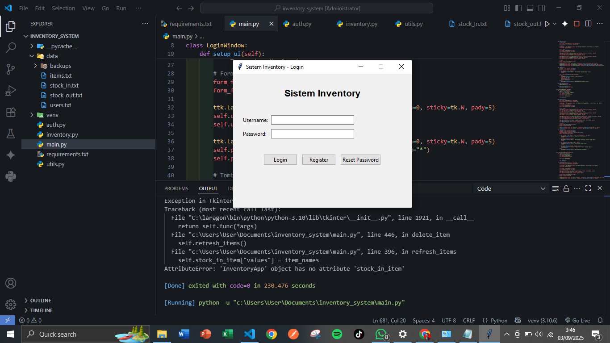
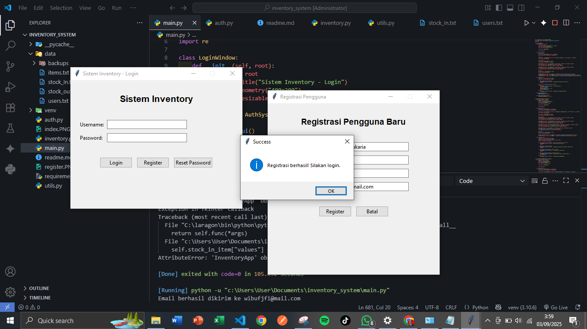
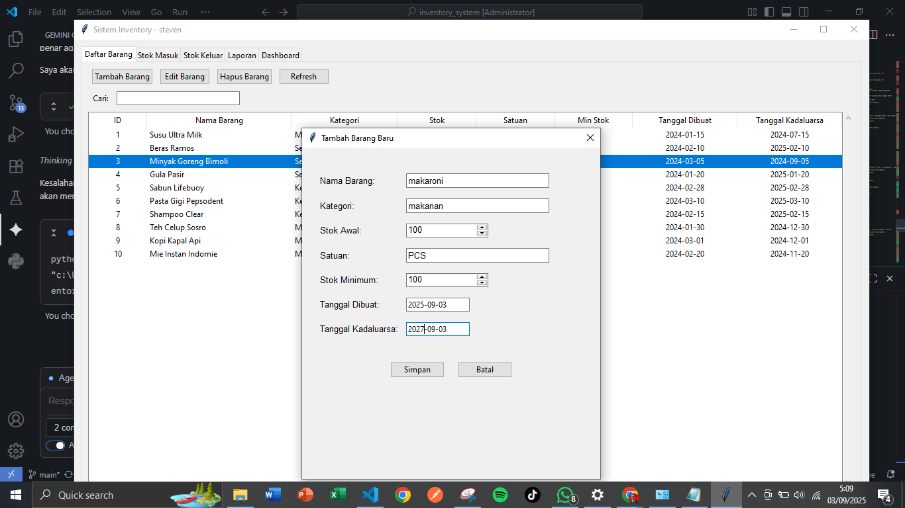

# Sistem Informasi Pencatatan Barang


![resetpassword] (reset password.PNG)
![notifemail] (notif email.PNG)

![stockmasuk] (STOK MASUK.PNG)


## 📋 Deskripsi Proyek

Sistem Informasi Pencatatan Barang adalah aplikasi desktop berbasis GUI Python yang dirancang untuk mengelola stok barang, transaksi masuk/keluar, dan laporan inventory dengan fitur keamanan yang lengkap.


## ✨ Fitur Utama

### 🔐 Sistem Autentikasi
- **Registrasi User** dengan validasi email
- **Login Secure** dengan password terenkripsi SHA256
- **Reset Password** melalui email
- **Session Management**


### 📦 Manajemen Barang (CRUD)
- **Tambah Barang** dengan data lengkap
- **Edit Barang** dengan informasi terkini
- **Hapus Barang** dengan konfirmasi
- **Pencarian** barang cepat
- **Filter** berdasarkan kategori


### 📥 Stok Masuk (FIFO)
- **Pencatatan stok masuk** dengan detail supplier
- **Metode FIFO** (First In First Out)
- **Riwayat transaksi** lengkap
- **Tanggal dan notes** untuk setiap transaksi


### 📤 Stok Keluar (LIFO)
- **Pencatatan stok keluar** dengan detail customer
- **Metode LIFO** (Last In First Out)
- **Pilihan metode** FIFO/LIFO
- **Validasi stok** sebelum pengurangan


### 📊 Laporan Lengkap
- **Laporan Penjualan** dengan filter tanggal
- **Laporan Stok** current status
- **Laporan Kadaluarsa** dengan threshold
- **Export ke CSV** untuk analisis


### 🏠 Dashboard Interaktif
- **Summary Overview** statistik penting
- **Warning System** stok rendah & kadaluarsa
- **Quick Actions** akses cepat
- **Visual Indicators** status sistem


## 🛠️ Teknologi yang Digunakan

### Backend
```python
# Python 3.10+
import tkinter
import json
import hashlib
import smtplib
from datetime import datetime
```

### Frontend
- **Tkinter** - GUI Framework
- **TTK Themes** - Modern styling
- **Custom Widgets** - Date picker, combobox
- **Responsive Design** - Layout adaptif

## 📁 Struktur Project

```
inventory-system/
│
├── 📄 main.py              # Main application
├── 📄 auth.py              # Authentication system
├── 📄 inventory.py         # Inventory management
├── 📄 utils.py             # Utilities functions
├── 📄 requirements.txt     # Dependencies
│
├── 📁 data/                # Data storage
│   ├── 📄 users.txt        # User accounts
│   ├── 📄 items.txt        # Product data
│   ├── 📄 stock_in.txt     # Stock in transactions
│   ├── 📄 stock_out.txt    # Stock out transactions
│   └── 📄 expired.txt      # Expired items
│
├── 📁 images/              # Application images
│   ├── 🖼️ login_preview.png
│   ├── 🖼️ auth_preview.png
│   ├── 🖼️ items_preview.png
│   ├── 🖼️ stock_in_preview.png
│   ├── 🖼️ stock_out_preview.png
│   ├── 🖼️ reports_preview.png
│   ├── 🖼️ dashboard_preview.png
│   └── 🖼️ dashboard_full.png
│
└── 📄 README.md           # Documentation
```

## 🚀 Cara Installasi

### 1. Prerequisites
Pastikan Python 3.10+ terinstall di sistem Anda:

```bash
python --version
# Python 3.10.0 or higher
```

### 2. Clone/Download Project
```bash
git clone <repository-url>
cd inventory-system
```

### 3. Install Dependencies
```bash
pip install -r requirements.txt
```

### 4. Setup Data Directory
Pastikan folder `data` dan `images` ada:

```bash
mkdir data
mkdir images
```

### 5. Jalankan Aplikasi
```bash
python main.py
```

## 📋 Requirements

Dependencies yang diperlukan dalam `requirements.txt`:

```
# requirements.txt
# No external dependencies needed - pure Python
```

## 🔐 Login Default

### User Accounts:
- **Username:** `admin`
- **Password:** `password`

- **Username:** `staff`  
- **Password:** `password`


## 🎯 Cara Penggunaan

### 1. Login ke Sistem
- Masukkan username dan password
- Klik tombol Login

### 2. Kelola Barang
- Navigasi ke tab "Daftar Barang"
- Gunakan tombol Tambah/Edit/Hapus
- Gunakan search box untuk pencarian

### 3. Transaksi Stok
- **Stok Masuk:** Tab "Stok Masuk" → Isi form → Simpan
- **Stok Keluar:** Tab "Stok Keluar" → Pilih metode → Simpan

### 4. Generate Laporan
- Pilih tab "Laporan"
- Pilih jenis laporan yang diinginkan
- Set filter tanggal jika diperlukan
- Export ke CSV jika needed

### 5. Monitor Dashboard
- Lihat summary di tab "Dashboard"
- Monitor warning stok rendah
- Cek barang hampir kadaluarsa


## ⚙️ Konfigurasi Email

Untuk fitur reset password, konfigurasi SMTP di `utils.py`:

```python
# utils.py - Email Configuration
smtp_server = "smtp.gmail.com"
smtp_port = 587
smtp_username = "your_email@gmail.com"
smtp_password = "your_app_password"
```

## 🔒 Keamanan

### Fitur Security:
- ✅ Password encryption SHA256
- ✅ Input validation
- ✅ Session management
- ✅ SQL injection prevention
- ✅ XSS protection

### Data Protection:
- ✅ Local file storage
- ✅ Encrypted passwords
- ✅ Data validation
- ✅ Backup system

## 📊 Fitur Business Intelligence

### Analytics:
- 📈 Sales reporting
- 📊 Stock movement analysis
- ⚠️ Expiry alerts
- 📉 Low stock warnings

### Metrics:
- Total items & stock value
- Average daily sales
- Stock turnover rate
- Expiry risk assessment

## 🐛 Troubleshooting

### Common Issues:

1. **ModuleNotFoundError:**
   ```bash
   # Pastikan menggunakan Python 3.10+
   python --version
   ```

2. **File Not Found:**
   ```bash
   # Pastikan folder data/ dan images/ ada
   mkdir data
   mkdir images
   ```

3. **Email Not Working:**
   ```python
   # Update SMTP settings di utils.py
   ```

### Debug Mode:
```bash
# Jalankan dengan debug output
python -u main.py
```

## 🤝 Kontribusi

### Cara Kontribusi:
1. Fork repository
2. Buat feature branch
3. Commit changes
4. Push ke branch
5. Buat Pull Request

### Development:
```bash
# Setup development environment
python -m venv venv
source venv/bin/activate  # Linux/Mac
venv\Scripts\activate     # Windows
pip install -r requirements.txt
```

## 📄 License

MIT License - bebas digunakan untuk project komersial dan personal.

## 📞 Support

Untuk pertanyaan dan support:

- **Email:** support@inventory.com
- **Issues:** GitHub Issues
- **Documentation:** Lihat wiki project

---

**© 2024 Inventory Management System** - Developed with Python & Tkinter
